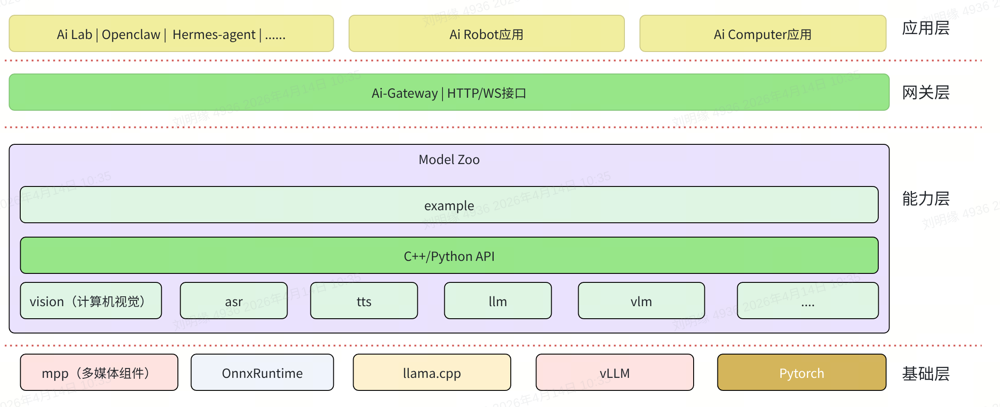
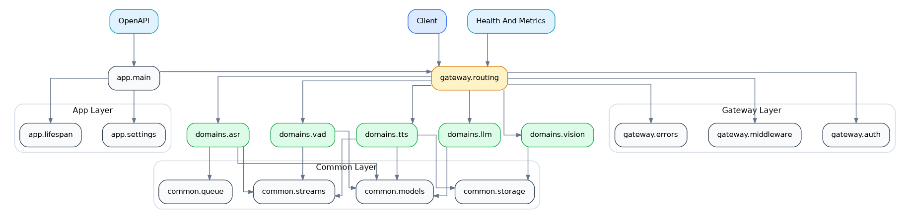
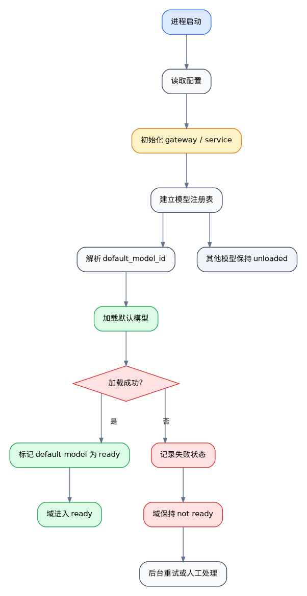
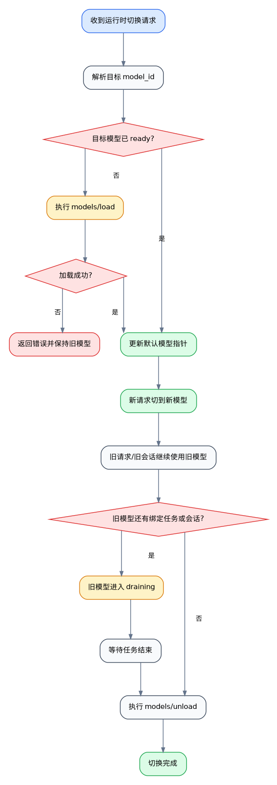
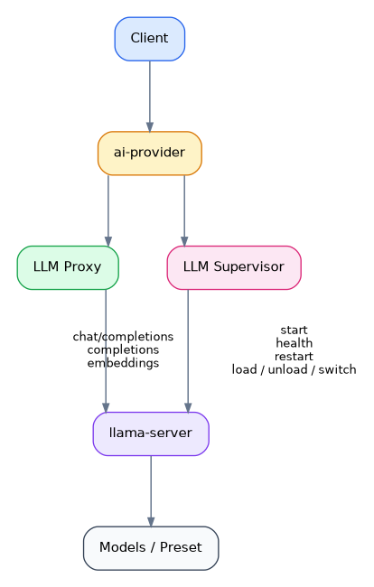

# AI Gateway 开发者实现指南

---

## 1. 架构设计

AI Gateway所处的位置



共建组件：
- 网关层： https://gitlab.dc.com:8443/bianbu/spacemit_claw/spacemit-ai-gateway（开发完成后推到github）
- 能力层： https://github.com/spacemit-com/model-zoo
- 基础层： mpp、ort、llama.cpp、vLLM、Pytorch

共建应用：
- AI LAB： 在线化AI体验中心
- Agent：Openclaw、hermess agent..

差异化应用
- Ai Robot应用： onmi-agent、rivision
- Ai Computer应用： 知了、与会、灵狐


### 1.1 设计目标

- 优先实现“**单仓、单应用、分域模块化**”的服务端框架，而不是一开始拆成多个微服务。
- 让目录同时满足三件事：**域划分清晰、Python 包可维护、后续易于拆域独立部署**。
- 统一沉淀跨域公共能力，如鉴权、错误码、健康检查、日志、指标、任务状态与流会话管理，避免在各域重复实现。
- 保持“**域优先、层次清晰**”原则：先按 ASR / TTS / VAD / LLM / Vision 划分边界，再在域内拆分 `api / schemas / service / adapters`。
- 各域优先复用现有 `model_zoo/*`、`llama-server` 等已有 Python / C++ 接口，避免重复封装和重复造轮子。
- 配置与运行环境解耦：通过统一配置管理不同部署环境、默认模型、资源限制与功能开关，而不是把这些差异写死在代码中。

### 1.2 框图设计



说明：

- `app/` 负责进程启动、配置装配、生命周期管理与 OpenAPI 输出。
- `gateway/` 负责跨域公共能力：鉴权、错误处理、中间件、统一路由注册。
- `common/` 提供领域共享基础设施，如任务状态、流会话、队列、存储与通用模型。
- `domains/` 按 **ASR / TTS / VAD / LLM / Vision** 分治，每个域内部再拆 `api / schemas / service / adapters`。
- 各域在 `adapters/` 中直接调用已有的 Python / C++ 接口，不再额外设计独立 `integrations/` 目录。

### 1.3 目录结构

```text
spacemit-ai-gateway/
├── ai-gateway.md
├── reference.md
├── README.md
├── pyproject.toml
├── scripts/
├── configs/
│   ├── base.yaml
│   ├── dev.yaml
│   └── prod.yaml
├── examples/
├── tests/
│   ├── unit/
│   ├── integration/
│   └── contracts/
└── src/
    └── spacemit_ai_gateway/
        ├── app/
        │   ├── main.py
        │   ├── settings.py
        │   ├── lifespan.py
        │   └── openapi.py
        ├── gateway/
        │   ├── auth.py
        │   ├── errors.py
        │   ├── health.py
        │   ├── metrics.py
        │   ├── middleware.py
        │   └── routing.py
        ├── common/
        │   ├── enums.py
        │   ├── ids.py
        │   ├── models.py
        │   ├── queue.py
        │   ├── storage.py
        │   ├── streams.py
        │   └── utils.py
        ├── domains/
        │   ├── asr/
        │   │   ├── api.py
        │   │   ├── schemas.py
        │   │   ├── service.py
        │   │   ├── jobs.py
        │   │   ├── stream.py
        │   │   ├── lexicons.py
        │   │   └── adapters/
        │   ├── tts/
        │   │   ├── api.py
        │   │   ├── schemas.py
        │   │   ├── service.py
        │   │   ├── tasks.py
        │   │   ├── stream.py
        │   │   ├── lexicons.py
        │   │   └── adapters/
        │   ├── vad/
        │   │   ├── api.py
        │   │   ├── schemas.py
        │   │   ├── service.py
        │   │   ├── stream.py
        │   │   ├── segments.py
        │   │   └── adapters/
        │   ├── llm/
        │   │   ├── api.py
        │   │   ├── schemas.py
        │   │   ├── service.py
        │   │   └── adapters/
        │   └── vision/
        │       ├── api.py
        │       ├── schemas.py
        │       ├── service.py
        │       ├── stream.py
        │       ├── sequence.py
        │       ├── features.py
        │       ├── models.py
        │       └── adapters/
```

说明：

- 根目录继续承担“规范中心”角色，文档与实现并存但不混杂。
- `configs/` 只保留环境级配置；各域参数统一放在 `base.yaml` / `dev.yaml` / `prod.yaml` 的命名空间下，不再拆 `domains/*.yaml`。
- `examples/` 只放 curl、HTTP、WebSocket 最小示例，不放核心实现。
- `tests/contracts/` 负责校验 OpenAPI 与本文契约一致。
- `domains/*/adapters/` 直接对接 `llama-server` 或 `model_zoo/*` 已提供的接口，避免重复封装一层集成目录。

### 1.4 模型选择

本节只定义**模型选择与切换策略**，不展开具体推理逻辑实现。统一原则是：每个域在初始化时**预先默认加载一个模型**，保证服务启动后立即可用；运行过程中如需切换模型，则通过运行时模型管理接口完成，并且默认只影响**新请求 / 新任务 / 新会话**。


#### 1.4.1 初始化状态：默认加载一个模型

设计说明：

- 每个域在配置中都应声明一个 `default_model_id`。
- 服务启动时先完成配置加载、路由注册、健康检查与模型注册表初始化。
- 注册表初始化完成后，只预加载当前域的一个默认模型，不要求一次性把所有候选模型全部加载进内存。
- 若默认模型加载成功，则该域进入 `ready`；若失败，则该域保持 `not ready` 并进入重试或告警流程。
- 其他模型保持 `unloaded`，在后续请求、显式 `load` 指令或自动预热策略触发时再进入 `loading` / `ready`。



#### 1.4.2 运行时切换

设计说明：

- 运行时切换通过 `models/load`、`models/unload`、`models/switch` 等接口完成。
- `load` 的职责是把目标模型加载到运行时；`switch` 的职责是把默认模型指针切到新模型；`unload` 的职责是释放空闲旧模型。
- 切换默认模型时，建议采用“先加载新模型，再切默认指针，最后释放旧模型”的顺序，避免先卸载旧模型导致服务短暂不可用。
- 已经建立的异步任务、流式连接和长连接请求应继续绑定旧模型；切换只影响新请求、新任务和新连接。
- 对于流式域，如 ASR / VAD / Vision，若要改用新模型，应新建连接或新的 `stream_id`，而不是在原连接中强制漂移模型。



### 1.5 LLM 域封装设计

LLM 域不在 `spacemit-ai-gateway` 进程内直接实现推理，而是把 `llama-server` 作为独立 LLM 数据面服务；`spacemit-ai-gateway` 只做两件事：

- 推理调用：走代理转发。像 `/v1/chat/completions`、`/v1/completions`、`/v1/embeddings` 这类接口，由 `spacemit-ai-gateway` 先做统一鉴权、日志、请求 ID、默认模型补全，然后把请求转发到 `llama-server`，响应基本原样透传回来。这一层本质上就是 `reverse proxy / gateway adapter`。
- 运行时管理：走控制器。像启动 `llama-server`、重启、检查 `/health`、设置默认模型、调用 `/models/load` / `/models/unload`，由 `spacemit-ai-gateway` 内部的 `runtime manager / supervisor` 负责。这一层不是代理，而是监管 `llama-server` 进程和模型状态。

因此，LLM 域的原则是：`spacemit-ai-gateway` 负责“管”，`llama-server` 负责“算”；推理接口尽量不改协议，部署与模型细节不暴露给客户端，客户端仍只使用 `model` 或统一的 `model_id`。



实现上建议统一保留 `llm.*` 配置命名空间，例如：`llm.mode`、`llm.base_url`、`llm.bind_host`、`llm.bind_port`、`llm.router_enabled`、`llm.default_model_id`、`llm.models_preset_path`、`llm.startup_args`、`llm.models[]`。其中单模型场景可直接用 `-m` 启动；多模型场景优先采用 `router mode + --models-preset`，这样运行时切换可以直接复用 `llama-server` 原生能力。


---


## 2. 总表

**说明**：**HTTP(S)** 与 **WebSocket** 共用同一主机与端口时，仅路径与协议不同；流式接口已分别写在各域分表与正文中。

### 2.0 网关公共能力（跨域）

| 分类 | 载体 / 路径 | 适用范围 | 说明 |
|------|-------------|----------|------|
| 鉴权 | `X-API-Key` 或统一 Header 策略 | ASR / TTS / VAD / Vision 及后续统一网关入口 | 认证方式由网关统一定义，各域接口不重复发明鉴权方案 |
| 错误码 | HTTP 状态码 + 统一错误响应体 | 全域 | 错误码、错误消息、可重试标记、请求 ID 等应保持一致 |
| 健康检查 | 根路径 `GET /healthz` + 各域 `/v1/*/healthz` | 全域 | 根路径表示整服务聚合状态；域路径表示子域存活与就绪 |
| 日志与指标 | 访问日志、业务日志、`/metrics`、各域 `/stats` | 全域 | 跨域统一日志字段、指标口径与监控标签，避免各域各自定义 |

### 2.1 ASR（`http://127.0.0.1:18790`）

路径以 **`/v1/asr`** 为准；无前缀 **`/asr/...`** 可作为遗留别名（§3）。**可选实现**：`GET /v1/asr/info`（引擎运行态摘要）见 §3.4。

| 维度 | 方法 | 路径 | 功能描述 | 核心参数 / 说明 |
|------|------|------|----------|-----------------|
| 1. 实时交互 | POST | `/v1/asr/recognize` | 同步短语音识别 | 一次性上传二进制音频，适用于指令控制、语音搜索 |
| 1. 实时交互 | WS | `/v1/asr/stream` | 实时流式识别 | 基于 WebSocket，在握手 Query 或首帧 `start` 中协商参数，支持 `partial_results`（中间结果） |
| 2. 异步长任务 | POST | `/v1/asr/jobs` | 提交异步转写任务 | 支持 `audio_url` 及 `callback_url`（回调地址） |
| 2. 异步长任务 | GET | `/v1/asr/jobs/{id}` | 查询任务状态/结果 | 返回 `PENDING`（排队）、`RUNNING`、`DONE`、`FAILED` |
| 2. 异步长任务 | DELETE | `/v1/asr/jobs/{id}` | 取消/停止任务 | 强制终止正在运行或排队的长任务，释放资源 |
| 3. 推理与资源 | GET/PATCH | `/v1/asr/params` | 推理参数管理 | 控制语言、标点、热词权重、ITN |
| 3. 推理与资源 | GET/PATCH | `/v1/asr/audio` | 音频预处理配置 | 降噪开关、自动增益 |
| 3. 推理与资源 | GET/POST | `/v1/asr/lexicons` | 热词/词库管理 | 支持创建和更新行业专有名词库，提升识别准度 |
| 3. 推理与资源 | GET | `/v1/asr/models` | 模型列表发现 | 查询当前可用模型版本（如：通用型、同传型、大模型版） |
| 3. 推理与资源 | POST | `/v1/asr/models/load` | 加载模型 | `model_id`；加载已注册模型，供后续新请求使用 |
| 3. 推理与资源 | POST | `/v1/asr/models/unload` | 卸载模型 | `model_id`；卸载空闲模型，不影响已建立流连接 |
| 3. 推理与资源 | POST | `/v1/asr/models/switch` | 切换默认模型 | `model_id`；只影响新请求与新连接 |
| 4. 系统与运维 | GET/PATCH | `/v1/asr/engine` | 引擎规格与硬件 | 计算线程数、AI 加速资源分配、功耗模式 |
| 4. 系统与运维 | GET | `/v1/asr/stats` | 性能指标监控 | 返回 RTF（实时率）、并发数、硬件占用、错误分布 |
| 4. 系统与运维 | GET | `/v1/asr/healthz` | 健康检查 | ASR 域 Liveness/Readiness；整网关可用根路径 `GET /healthz`（§1.3） |
| 4. 系统与运维 | GET | `/v1/asr/languages` | 支持语种查询 | 获取当前加载模型所支持的全部 ISO 语言编码列表 |

### 2.2 TTS（`http://127.0.0.1:18790`）

路径以 **`/v1/tts`** 为准；无前缀 **`/tts/...`** 可作为遗留别名（§4）。**可选实现**：`GET /v1/tts/info` 见 §4.5 末。

| 维度 | 方法 | 路径 | 功能描述 | 核心扩展参数 / 说明 |
|------|------|------|----------|---------------------|
| 1. 实时合成 | POST | `/v1/tts/synthesize` | 同步短文本合成 | 增加 **`ssml`** 字段；**`response_format`** 支持 `mp3` / `opus` / `pcm`（等） |
| 1. 实时合成 | WS | `/v1/tts/stream` | 流式交互合成 | 支持「边传文本边出声」；返回帧增加 **`metadata`**（含时间戳，利口型/字幕） |
| 2. 长文本异步 | POST | `/v1/tts/jobs` | 提交长文本任务 | 针对数千字文档，返回 `job_id`；支持 **`callback_url`** |
| 2. 长文本异步 | GET | `/v1/tts/jobs/{id}` | 查询任务进度 | 合成百分比、下载链接或错误状态 |
| 3. 资源查询 | GET | `/v1/tts/voices` | 音色列表（增强） | 除 ID 外：性别、年龄段、适用场景（新闻/情感等） |
| 3. 资源查询 | GET | `/v1/tts/models` | 合成模型列表发现 | 当前可用模型/版本与能力标签；与请求体 **`model`** 对齐（不单独依赖「后端名」发现） |
| 3. 资源查询 | POST | `/v1/tts/models/load` | 加载模型 | `model_id`；加载已注册模型或音色后端 |
| 3. 资源查询 | POST | `/v1/tts/models/unload` | 卸载模型 | `model_id`；卸载空闲模型，不影响在途任务 |
| 3. 资源查询 | POST | `/v1/tts/models/switch` | 切换默认模型 | `model_id`；只影响新请求与新任务 |
| 4. 配置与发音 | GET/PATCH | `/v1/tts/params` | 推理参数管理 | （原 Config 拆分）默认语速、音高、音量、情感强度 |
| 4. 配置与发音 | GET/POST | `/v1/tts/lexicons` | 发音词典/别名 | 专有名词与多音字读法纠错 |
| 5. 系统与运维 | GET/PATCH | `/v1/tts/engine` | 引擎规格 | （原 Config 拆分）计算线程数、采样率设置、缓存策略 |
| 5. 系统与运维 | GET | `/v1/tts/stats` | 性能指标 | RTF（合成时长/音频时长）、并发任务数、内存占用 |
| 5. 系统与运维 | GET | `/v1/tts/healthz` | 健康检查 | TTS 域存活与就绪；整网关可用根路径 `GET /healthz`（§1.3） |

### 2.3 VAD（`http://127.0.0.1:18790`）

路径以 **`/v1/vad`** 为准；无前缀 **`/vad/...`** 可作为遗留别名（§5）。**可选实现**：`GET /v1/vad/info` 见 §5.4 末。

| 维度 | 方法 | 路径 | 功能描述 | 核心参数 / 说明 |
|------|------|------|----------|-----------------|
| 1. 实时/流式 | WS | `/v1/vad/stream` | 流式实时检测 | 二进制传 PCM；服务端回 JSON（含 **`event`**：`speech_start` / `speech_end` 等） |
| 1. 实时/流式 | POST | `/v1/vad/analyze` | 短片段即时检测 | （原 `detect`）约 100～500ms 音频；返回是否有人声概率 |
| 2. 批量处理 | POST | `/v1/vad/segments` | 整段音频静音切分 | （原 `scan`）返回 `List<{start, end, confidence}>`，供 ASR 预处理 |
| 3. 模型与参数 | GET | `/v1/vad/models` | 模型列表发现 | 返回当前可用 VAD 模型、能力标签与状态 |
| 3. 模型与参数 | POST | `/v1/vad/models/load` | 加载模型 | `model_id`；加载已注册 VAD 模型 |
| 3. 模型与参数 | POST | `/v1/vad/models/unload` | 卸载模型 | `model_id`；卸载空闲模型，不影响已建立流会话 |
| 3. 模型与参数 | POST | `/v1/vad/models/switch` | 切换默认模型 | `model_id`；只影响新请求与新流会话 |
| 3. 参数控制 | GET/PATCH | `/v1/vad/params` | 感知参数调优 | （原 Config 拆分）`threshold`、`min_speech_ms`、`max_silence_ms` |
| 3. 参数控制 | GET/PATCH | `/v1/vad/audio` | 音频输入配置 | （原 Config 拆分）`sample_rate`、`bit_depth`、是否开启降噪（Denoise） |
| 4. 系统运维 | GET/PATCH | `/v1/vad/engine` | 引擎规格与资源 | 计算线程、AI 加速资源优先级、内存占用限制 |
| 4. 系统运维 | GET | `/v1/vad/stats` | 运行状态监控 | 实时延迟（Latency）、当前 SNR、总唤醒次数 |
| 4. 系统运维 | GET | `/v1/vad/healthz` | 健康检查 | VAD 域存活/就绪；整网关可用根路径 `GET /healthz`（§1.3） |

### 2.4 Text / LLM（`llama-server`）

路径相对 **llama-server** 根 URL（如 `http://127.0.0.1:8080`）；若配置了 `--api-prefix` 需加前缀。

| 分类 | 方法 | 路径 | 主要参数 | 说明 |
|------|------|------|----------|------|
| 健康检查 | GET | `/health`, `/v1/health` | 无 | 服务健康状态 |
| 模型发现 | GET | `/v1/models` | 无 | OpenAI 兼容模型信息 |
| 模型发现 | GET | `/models` | 无 | 路由器模式模型列表 |
| 模型发现 | GET | `/api/tags` | 无 | Ollama 风格模型列表别名 |
| 模型信息 | POST | `/api/show` | 无 | 返回模板、能力、模型摘要 |
| 文本补全 | POST | `/completion` | `prompt`, `n_predict`, `stream` | 原生补全 |
| 文本补全 | POST | `/completions` | `prompt`, `n_predict`, `stream` | 原生补全别名 |
| 文本补全 | POST | `/v1/completions` | `model`, `prompt`, `max_tokens`, `stream` | OpenAI 兼容补全 |
| 对话 | POST | `/chat/completions` | `messages`, `stream` | 原生 chat 路径 |
| 对话 / VLM | POST | `/v1/chat/completions` | `model`, `messages`, `stream`, `response_format` | OpenAI 兼容 chat，多模态主入口 |
| 对话 | POST | `/api/chat` | `messages`, `stream` | Ollama 风格 chat 别名 |
| Responses | POST | `/v1/responses`, `/responses` | `model`, `instructions`, `input`, `stream` | OpenAI Responses 兼容 |
| Anthropic | POST | `/v1/messages` | `model`, `messages`, `max_tokens`, `tools` | Anthropic Messages 兼容 |
| Anthropic | POST | `/v1/messages/count_tokens` | `model`, `messages` | 只统计 token |
| Embedding | POST | `/embedding` | `content`, `embd_normalize` | 原生 embedding |
| Embeddings | POST | `/embeddings` | `input` | 原生 embeddings，支持更多 pooling |
| Embeddings | POST | `/v1/embeddings` | `model`, `input`, `encoding_format` | OpenAI 兼容 embeddings |
| Rerank | POST | `/rerank`, `/reranking`, `/v1/rerank`, `/v1/reranking` | `model`, `query`, `documents`, `top_n` | 文档重排序 |
| Tokenize | POST | `/tokenize` | `content`, `add_special`, `parse_special`, `with_pieces` | 文本转 token |
| Detokenize | POST | `/detokenize` | `tokens` | token 转文本 |
| Template | POST | `/apply-template` | `messages` | 只套用聊天模板 |
| Infill | POST | `/infill` | `input_prefix`, `input_suffix`, `input_extra`, `prompt` | 前后缀填空 |
| 属性 | GET | `/props` | 无 | 查看服务属性 |
| 属性 | POST | `/props` | 当前无明确字段 | 修改服务属性，需 `--props` |
| Slot | GET | `/slots` | `fail_on_no_slot` | 查看 slot 状态 |
| Slot | POST | `/slots/{id_slot}?action=save` | `filename` | 保存 prompt cache |
| Slot | POST | `/slots/{id_slot}?action=restore` | `filename` | 恢复 prompt cache |
| Slot | POST | `/slots/{id_slot}?action=erase` | 无 | 清空 prompt cache |
| 指标 | GET | `/metrics` | 无 | Prometheus 指标 |
| LoRA | GET | `/lora-adapters` | 无 | 查看适配器列表 |
| LoRA | POST | `/lora-adapters` | `[{id, scale}]` | 设置全局 LoRA scale |
| Router | POST | `/models/load` | `model` | 加载模型 |
| Router | POST | `/models/unload` | `model` | 卸载模型 |

### 2.5 Vision（model-zoo-vision）

服务根 URL 示例 **`http://127.0.0.1:8000`**（与语音网关不同端口）。算法与配置对齐 **`spacemit_robot/components/model_zoo/vision`**（`VisionService`、`examples/*/config`、`applications/*/config`）。详见 §7；**`GET /openapi.json`** 为权威字段表。

| 维度 | 方法 | 路径 | 功能描述 | 核心参数 / 说明 |
|------|------|------|----------|-----------------|
| 1. 实时感知（Sync） | POST | `/v1/vision/inference` | 多任务合一推理 | **`tasks[]`**、`file` / `handle`、`model_id`；减少重复传图与重复预处理 |
| 1. 实时感知（Sync） | POST | `/v1/vision/feature` | 特征提取 / 相似度 | `file`、`type=embedding|similarity`、`model_id`；可扩第二张图或向量 |
| 2. 视频流（Stream） | WS | `/v1/vision/stream` | 低延迟实时流 | 在握手 Query 或首帧 `start` 中声明 `model_group`、`fps_limit`、`priority` 等参数；支持心跳、事件推送与时间戳 |
| 2. 视频流（Stream） | DELETE | `/v1/vision/stream/{id}` | 释放流资源 | 按 `stream_id` 显式释放跟踪器状态与 AI 加速缓存资源；可选实现 |
| 3. 异步任务（Jobs） | POST | `/v1/vision/jobs` | 提交离线任务 | `input_uri`、`tasks[]`、`callback_url`、`render`；适用于长视频、批量图片、回调通知 |
| 3. 异步任务（Jobs） | GET | `/v1/vision/jobs/{id}` | 查询任务状态/结果 | 返回 `PENDING`、`RUNNING`、`DONE`、`FAILED`、`CANCELLED` 与产物地址 |
| 3. 异步任务（Jobs） | DELETE | `/v1/vision/jobs/{id}` | 取消任务 | 停止排队或运行中的离线分析任务 |
| 4. 序列动作（Seq） | POST | `/v1/vision/sequence` | 序列动作识别 | `sequence_data`、`window_size`；与 `InferSequence` 语义对齐 |
| 5. 资源管理 | GET | `/v1/vision/models` | 模型发现与能力查询 | `tags`、`backend` 过滤；返回 `model_id`、能力标签、默认参数摘要 |
| 5. 资源管理 | POST | `/v1/vision/models/load` | 热加载 / 切换模型 | `model_id`、`engine_config`；不对外暴露底层配置文件路径 |
| 5. 资源管理 | POST | `/v1/vision/models/unload` | 卸载模型 | `model_id`；卸载空闲模型，不影响已建立流连接 |
| 5. 资源管理 | POST | `/v1/vision/models/switch` | 切换默认模型/模型组 | `model_id` 或 `model_group`；只影响新请求与新连接 |
| 6. 运维与参数 | GET/PATCH | `/v1/vision/params` | 推理参数调优 | `conf`、`iou`、`roi_masks` 等 |
| 6. 运维与参数 | GET/PATCH | `/v1/vision/engine` | 引擎资源配置 | `ai_core_group`、`threads`、`precision` 等 |
| 6. 运维与参数 | GET | `/v1/vision/stats` | 性能与硬件指标 | `rtf`、`fps`、`ai_temp`、`queue`、`infer_ms` 等 |
| 6. 运维与参数 | GET | `/v1/vision/healthz` | 健康检查 | Vision 子域就绪；根路径 `GET /healthz` 表示整服务状态 |


## 3. ASR（语音转文本）

以下为 ASR 领域接口说明。路径以 **`/v1/asr`** 为版本化前缀；若实现保留无前缀别名（如 `POST /asr/recognize`），请在 **`GET /openapi.json`** 中声明。

### 3.1 实时交互

#### POST `/v1/asr/recognize`

用途：同步短语音识别，适用于指令控制、语音搜索等低延迟场景。

关键参数：

| 参数 | 说明 |
|------|------|
| body | 必填。`application/octet-stream`；支持 WAV / OGG / MP3 / FLAC / raw PCM。 |
| `language` | 语种；默认 `zh`，支持 `zh` / `en` / `ja` / `ko` / `yue` / `auto`。 |
| `sample_rate` | 音频采样率；`0` 表示自动探测。 |
| `punctuation` | 是否添加标点；默认 `true`。 |
| `word_timestamps` | 是否返回词级时间戳；默认 `false`。 |
| `hotwords` | 逗号分隔热词；与 `/v1/asr/lexicons` 词库互补。 |

返回重点：

- `text`：最终识别文本。
- `sentences`：分句结果；启用词级时间戳时可含 `words`。
- `duration_ms`、`processing_ms`、`rtf`：时长与性能指标。

示例响应：

```json
{
  "text": "打开客厅的灯",
  "sentences": [
    {
      "start_ms": 0,
      "end_ms": 1280,
      "text": "打开客厅的灯",
      "words": [
        { "text": "打开", "start_ms": 0, "end_ms": 320 },
        { "text": "客厅", "start_ms": 320, "end_ms": 760 },
        { "text": "的灯", "start_ms": 760, "end_ms": 1280 }
      ]
    }
  ],
  "duration_ms": 1280,
  "processing_ms": 146,
  "rtf": 0.11
}
```

#### WebSocket `/v1/asr/stream`

用途：实时连续音频识别；客户端建立 WebSocket 后，在握手 Query 或首帧 `start` 中声明识别参数，随后持续发送音频分片，服务端多次推送中间结果与句末结果。

连接 URL：

- `ws://{host}:{port}/v1/asr/stream`
- `wss://{host}:{port}/v1/asr/stream`

握手 Query：

| 参数 | 说明 |
|------|------|
| `language` | 默认 `zh`。 |
| `sample_rate` | 须与上传 PCM 一致。 |
| `encoding` | 音频编码；如 `pcm_s16le` / `opus`。 |
| `punctuation` | 是否加标点。 |
| `partial_results` | `true` 时返回中间结果。 |
| `hotwords` | 逗号分隔热词。 |
| `token` | 可选；鉴权令牌。 |

客户端发送：

| 顺序 | 类型 | 说明 |
|------|------|------|
| 1（可选） | JSON 文本 | `type: start`；覆盖或补充握手参数，如 `language`、`sample_rate`、`encoding`、`partial_results`、`hotwords`。 |
| 2…N | 二进制 | 音频分片；建议 20ms～200ms 一档。 |
| 末尾 | JSON 文本 | `{"type":"end"}`；表示输入结束。 |

服务端返回：

| `type` | 说明 |
|--------|------|
| `ready` | 服务端已就绪，并返回本连接的 `stream_id` 及最终生效参数。 |
| `partial` | 中间识别结果。 |
| `sentence_end` | 句末稳定结果。 |
| `final` | 整段汇总结果。 |
| `error` | 错误信息。 |
| `done` | 连接正常结束。 |

说明：

- 默认音频约定为单声道、16-bit PCM。
- 如 Query 与首帧 `start` 同时提供参数，建议以首帧 `start` 为准。
- 服务端内部可为每条流连接分配 `stream_id`，用于日志、追踪和观测；它不是独立的业务会话资源。
- 流式未就绪时，握手可返回 `503`，或首帧返回 `error`。

示例响应：

```json
{
  "type": "ready",
  "stream_id": "asr_stream_01JXYZ123",
  "params": {
    "language": "zh",
    "sample_rate": 16000,
    "encoding": "pcm_s16le",
    "partial_results": true
  }
}
```

```json
{ "type": "partial", "text": "打开客", "timestamp_ms": 420 }
```

```json
{ "type": "sentence_end", "text": "打开客厅的灯。", "start_ms": 0, "end_ms": 1280 }
```

```json
{ "type": "done", "stream_id": "asr_stream_01JXYZ123" }
```

### 3.2 异步长任务

适用于长音频、离线转写与回调通知场景。

#### POST `/v1/asr/jobs`

用途：提交异步转写任务。

关键参数：

| 参数 | 说明 |
|------|------|
| `audio_url` | 音频可拉取地址。 |
| `callback_url` | 完成/失败回调地址。 |
| `language` | 语种。 |
| `model` | 可选模型标识。 |
| `priority` | 可选优先级。 |

返回重点：

- `job_id`：任务标识。
- `status`：初始状态，通常为 `PENDING`。

示例响应：

```json
{
  "job_id": "asr_job_01JXYZ456",
  "status": "PENDING",
  "created_at": "2026-04-13T10:20:00Z"
}
```

#### GET `/v1/asr/jobs/{id}`

用途：查询异步转写任务状态与结果。

关键参数：

- 路径参数 `id`：任务标识。

返回重点：

- `status`：`PENDING` / `RUNNING` / `DONE` / `FAILED`。
- `progress`、`queue_position`：实现可选的进度字段。
- 完成时返回识别结果，失败时返回错误信息。

示例响应：

```json
{
  "job_id": "asr_job_01JXYZ456",
  "status": "DONE",
  "progress": 100,
  "result": {
    "text": "会议将在下午三点开始",
    "duration_ms": 15320
  }
}
```

#### DELETE `/v1/asr/jobs/{id}`

用途：取消排队中或运行中的任务，并释放相关资源。

关键参数：

- 路径参数 `id`：任务标识。

说明：

- 若需区分“仅取消”与“删除历史记录”，可由实现增加查询参数或单独资源路径。
- `audio_url` 应明确大小上限、超时与鉴权策略；`callback_url` 应支持重试、幂等与签名校验。

示例响应：

```json
{
  "job_id": "asr_job_01JXYZ456",
  "status": "CANCELLED",
  "released": true
}
```

### 3.3 推理与资源

由旧版单一 `/asr/config` 拆分为多资源，便于权限与审计。

#### GET/PATCH `/v1/asr/params`

用途：管理推理侧参数。

关键参数：

| 参数 | 说明 |
|------|------|
| `language` | 默认语种。 |
| `punctuation` | 标点开关。 |
| `hotword_weight` | 热词权重。 |
| `itn` | 逆文本正则化开关。 |

返回重点：

- 当前参数快照。
- 可选 `effective_at` / `pending_restart`，表示生效时机。

示例响应：

```json
{
  "language": "zh",
  "punctuation": true,
  "hotword_weight": 1.2,
  "itn": true,
  "effective_at": "immediately"
}
```

#### GET/PATCH `/v1/asr/audio`

用途：管理音频预处理参数。

关键参数：

| 参数 | 说明 |
|------|------|
| `sample_rate` | 默认采样率。 |
| `vad_threshold` | VAD 阈值。 |
| `denoise` | 降噪开关。 |
| `agc` | 自动增益控制开关。 |

返回重点：

- 当前音频处理配置。

示例响应：

```json
{
  "sample_rate": 16000,
  "vad_threshold": 0.55,
  "denoise": true,
  "agc": false
}
```

#### GET/POST `/v1/asr/lexicons`

用途：管理热词与行业词库。

关键参数：

| 参数 | 说明 |
|------|------|
| `id` | 词库标识。 |
| `version` | 词库版本。 |
| `entries` | 热词或术语条目集合。 |
| `scope` | 生效范围。 |

返回重点：

- 词库列表、版本信息与生效范围。

示例响应：

```json
{
  "items": [
    {
      "id": "medical_terms",
      "version": "2026-04-13",
      "scope": "global",
      "entries": ["阿托伐他汀", "氯吡格雷"]
    }
  ]
}
```

#### GET `/v1/asr/models`

用途：列出可用 ASR 模型与能力标签。

关键参数：

- 无请求体。

返回重点：

- `id`：模型标识。
- `capabilities`：能力标签。
- `status` / `loaded`：是否已加载。

示例响应：

```json
{
  "data": [
    {
      "id": "asr-general-zh",
      "capabilities": ["streaming", "timestamps", "hotwords"],
      "loaded": true,
      "status": "ready"
    }
  ]
}
```

#### POST `/v1/asr/models/load`

用途：加载已注册 ASR 模型，使其可用于后续新请求与新连接。

关键参数：

| 参数 | 说明 |
|------|------|
| `model_id` | 必填。待加载模型标识。 |

返回重点：

- `loaded`：是否加载成功。
- `model_id`：当前加载的模型标识。
- `status`：通常为 `loading` 或 `ready`。

示例响应：

```json
{
  "loaded": true,
  "model_id": "asr-general-zh",
  "status": "ready"
}
```

#### POST `/v1/asr/models/unload`

用途：卸载已注册的空闲 ASR 模型；不影响已绑定的任务或流式会话。

关键参数：

| 参数 | 说明 |
|------|------|
| `model_id` | 必填。待卸载模型标识。 |

返回重点：

- `unloaded`：是否卸载成功。
- `model_id`：已卸载模型标识。

示例响应：

```json
{
  "unloaded": true,
  "model_id": "asr-general-zh"
}
```

#### POST `/v1/asr/models/switch`

用途：切换 ASR 默认模型；只影响新请求和新流会话。

关键参数：

| 参数 | 说明 |
|------|------|
| `model_id` | 必填。新的默认模型标识。 |

返回重点：

- `switched`：是否切换成功。
- `default_model_id`：切换后的默认模型。
- `effective_scope`：生效范围；通常为 `new_requests_only`。

示例响应：

```json
{
  "switched": true,
  "default_model_id": "asr-meeting-zh",
  "effective_scope": "new_requests_only"
}
```

### 3.4 系统与运维

#### GET/PATCH `/v1/asr/engine`

用途：查看或修改引擎规格与硬件资源配置。

关键参数：

| 参数 | 说明 |
|------|------|
| `num_threads` | 线程数。 |
| `device` | AI 融合算力资源绑定。 |
| `power_mode` | 功耗模式。 |

返回重点：

- 当前引擎规格。
- 可选 `pending_restart` / `effective_at`，表示配置变更生效方式。

示例响应：

```json
{
  "num_threads": 4,
  "device": "ai_cluster0",
  "power_mode": "balanced",
  "pending_restart": false
}
```

#### GET `/v1/asr/stats`

用途：获取 ASR 性能指标与运行状态。

关键参数：

- 无请求体。

返回重点：

- `rtf`、并发数、硬件占用、错误分布等。

示例响应：

```json
{
  "rtf": 0.18,
  "concurrency": 3,
  "device_usage": {
    "npu": 0.62,
    "memory_mb": 512
  },
  "errors": {
    "timeout": 1,
    "decode_failed": 0
  }
}
```

#### GET `/v1/asr/healthz`

用途：ASR 域就绪探针。

关键参数：

- 无请求体。

返回重点：

- 域级 `readiness` / `liveness`；根路径 `GET /healthz` 表示整网关聚合状态。

示例响应：

```json
{
  "status": "ok",
  "readiness": true,
  "liveness": true
}
```

#### GET `/v1/asr/languages`

用途：返回当前模型支持的 ISO 语言编码列表。

关键参数：

- 无请求体。

返回重点：

- 支持语言列表。
- 默认语言。

示例响应：

```json
{
  "default": "zh",
  "languages": ["zh", "en", "ja", "ko", "yue", "auto"]
}
```

**可选实现**：**GET `/v1/asr/info`** — 引擎运行态摘要；可返回 `initialized`、`backend`、`is_streaming` 等，并与 `engine` 互补。

---

## 4. TTS（文本转语音）

以下为 TTS 领域接口说明。路径以 **`/v1/tts`** 为版本化前缀；若实现保留无前缀别名（如 `POST /tts/synthesize`），请在 **`GET /openapi.json`** 中声明。

### 4.1 实时合成

#### POST `/v1/tts/synthesize`

用途：同步短文本合成，适用于播报、对话回复等低延迟整段返回场景。

关键参数：

| 参数 | 说明 |
|------|------|
| `text` | 必填；纯文本输入。 |
| `ssml` | 可选；SSML 片段或全文。 |
| `voice_id` / `speaker_id` | 音色标识。 |
| `model` | 合成模型标识；与 `/v1/tts/models` 对齐。 |
| `speed` | 语速。 |
| `pitch` | 音高。 |
| `volume` | 音量。 |
| `response_format` | 输出编码；如 `mp3` / `opus` / `pcm` / `wav`。 |

返回重点：

- 音频二进制响应。
- 常见响应头：`X-Sample-Rate`、`X-Duration-Ms`、`X-Processing-Ms`、`X-RTF`。

示例响应：

```text
HTTP/1.1 200 OK
Content-Type: audio/mpeg
X-Sample-Rate: 24000
X-Duration-Ms: 1680
X-Processing-Ms: 132
X-RTF: 0.08

<binary audio bytes>
```

#### WebSocket `/v1/tts/stream`

用途：流式交互合成，支持边传文本边出声。

连接 URL：

- `ws://{host}:{port}/v1/tts/stream`
- `wss://{host}:{port}/v1/tts/stream`

握手 Query：

| 参数 | 说明 |
|------|------|
| `token` | 可选；鉴权令牌。 |
| `response_format` | 输出编码；如 `pcm` / `opus`。 |
| `sample_rate` | 合成采样率。 |

客户端发送：

| 顺序 | 类型 | 说明 |
|------|------|------|
| 1 | JSON 文本 | `type: start`；可携带 `text` / `ssml`、`voice_id`、`model` 等。 |
| 2…N | JSON 文本 | `type: append`；追加后续文本。 |
| 末尾 | JSON 文本 | `type: end`；表示输入结束。 |

服务端返回：

| 类型 | 说明 |
|------|------|
| 文本 JSON | `ready`、`error`。 |
| 二进制 | 音频分片。 |
| 文本 JSON | `metadata`；时间线信息，用于字幕或口型同步。 |
| 文本 JSON | `done`；可携带 `duration_ms` 等摘要。 |

说明：

- 如实现改为 HTTP chunked 流式返回，应在 OpenAPI 中单列路径。

示例响应：

```json
{ "type": "ready", "sample_rate": 24000, "response_format": "pcm" }
```

```json
{
  "type": "metadata",
  "items": [
    { "text": "你好", "start_ms": 0, "end_ms": 380 },
    { "text": "世界", "start_ms": 380, "end_ms": 760 }
  ]
}
```

```json
{ "type": "done", "duration_ms": 760 }
```

### 4.2 长文本异步任务

适用于数千字级文本整段合成，避免同步请求超时。

#### POST `/v1/tts/jobs`

用途：提交长文本合成任务。

关键参数：

| 参数 | 说明 |
|------|------|
| `text` / `ssml` | 输入文本。 |
| `voice_id` | 音色标识。 |
| `model` | 合成模型标识。 |
| `response_format` | 输出编码。 |
| `callback_url` | 完成或失败回调地址。 |

返回重点：

- `job_id`：任务标识。
- `status`：初始状态，如 `PENDING`。

示例响应：

```json
{
  "job_id": "tts_job_01JXYZ789",
  "status": "PENDING",
  "created_at": "2026-04-13T10:30:00Z"
}
```

#### GET `/v1/tts/jobs/{id}`

用途：查询长文本合成任务进度与结果。

关键参数：

- 路径参数 `id`：任务标识。

返回重点：

- `status`：`RUNNING` / `DONE` / `FAILED` 等。
- `progress`：合成进度百分比。
- `download_url`：完成后的下载地址。

示例响应：

```json
{
  "job_id": "tts_job_01JXYZ789",
  "status": "DONE",
  "progress": 100,
  "download_url": "https://example.com/tts/tts_job_01JXYZ789.mp3"
}
```

说明：

- 可选实现 `DELETE /v1/tts/jobs/{id}` 取消任务。

### 4.3 资源查询

#### GET `/v1/tts/voices`

用途：返回音色列表及其元信息。

关键参数：

- 无请求体。

返回重点：

- `id`、`name`。
- `gender`、年龄段、适用场景等元信息。

示例响应：

```json
{
  "data": [
    {
      "id": "xiaoyun_female_v1",
      "name": "晓云",
      "gender": "female",
      "age_group": "adult",
      "scenes": ["news", "assistant"]
    }
  ]
}
```

#### GET `/v1/tts/models`

用途：发现可用 TTS 模型与能力标签。

关键参数：

- 无请求体；实现可扩展 `capability` 等过滤参数。

返回重点：

- `id`：模型标识。
- `capabilities`：能力标签，如多语种、情感风格等。
- `voice_scope`：适用音色范围。

示例响应：

```json
{
  "data": [
    {
      "id": "tts-expressive-zh",
      "capabilities": ["multilingual", "emotion", "streaming"],
      "voice_scope": ["xiaoyun_female_v1", "xiaofeng_male_v1"]
    }
  ]
}
```

#### POST `/v1/tts/models/load`

用途：加载已注册 TTS 模型，使其可用于后续新请求与新任务。

关键参数：

| 参数 | 说明 |
|------|------|
| `model_id` | 必填。待加载模型标识。 |

返回重点：

- `loaded`：是否加载成功。
- `model_id`：当前加载的模型标识。
- `status`：通常为 `loading` 或 `ready`。

示例响应：

```json
{
  "loaded": true,
  "model_id": "tts-expressive-zh",
  "status": "ready"
}
```

#### POST `/v1/tts/models/unload`

用途：卸载空闲 TTS 模型；不影响已提交的异步任务和正在进行的流式合成。

关键参数：

| 参数 | 说明 |
|------|------|
| `model_id` | 必填。待卸载模型标识。 |

返回重点：

- `unloaded`：是否卸载成功。
- `model_id`：已卸载模型标识。

示例响应：

```json
{
  "unloaded": true,
  "model_id": "tts-expressive-zh"
}
```

#### POST `/v1/tts/models/switch`

用途：切换 TTS 默认模型；只影响新请求与新任务。

关键参数：

| 参数 | 说明 |
|------|------|
| `model_id` | 必填。新的默认模型标识。 |

返回重点：

- `switched`：是否切换成功。
- `default_model_id`：切换后的默认模型。
- `effective_scope`：生效范围；通常为 `new_requests_only`。

示例响应：

```json
{
  "switched": true,
  "default_model_id": "tts-fast-zh",
  "effective_scope": "new_requests_only"
}
```

### 4.4 配置与发音

由旧版单一 `/tts/config` 拆分为 `params` 与 `lexicons`。

#### GET/PATCH `/v1/tts/params`

用途：管理 TTS 推理参数。

关键参数：

| 参数 | 说明 |
|------|------|
| `speed` | 默认语速。 |
| `pitch` | 默认音高。 |
| `volume` | 默认音量。 |
| `emotion_strength` | 情感强度。 |

返回重点：

- 当前参数快照。
- 可选 `effective_at` / `pending_restart`。

示例响应：

```json
{
  "speed": 1.0,
  "pitch": 0,
  "volume": 1.0,
  "emotion_strength": 0.6,
  "effective_at": "immediately"
}
```

#### GET/POST `/v1/tts/lexicons`

用途：管理发音词典与别名规则。

关键参数：

| 参数 | 说明 |
|------|------|
| `entries` | 词条集合。 |
| `phoneme` | 发音映射。 |
| `locale` | 语种或地区。 |

返回重点：

- 当前词典列表。
- 创建或更新后的版本信息。

示例响应：

```json
{
  "items": [
    {
      "id": "brand_lexicon",
      "locale": "zh-CN",
      "entries": [
        { "text": "SpacemiT", "phoneme": "si pei si mi ti" }
      ],
      "version": "v3"
    }
  ]
}
```

### 4.5 系统与运维

#### GET/PATCH `/v1/tts/engine`

用途：查看或修改 TTS 引擎规格。

关键参数：

| 参数 | 说明 |
|------|------|
| `threads` | 线程数。 |
| `sample_rate` | 默认采样率。 |
| `cache_policy` | 缓存策略。 |

返回重点：

- 当前引擎配置。
- 可选 `pending_restart` / `effective_at`。

示例响应：

```json
{
  "threads": 4,
  "sample_rate": 24000,
  "cache_policy": "lru",
  "pending_restart": false
}
```

#### GET `/v1/tts/stats`

用途：获取 TTS 性能指标。

关键参数：

- 无请求体。

返回重点：

- `rtf`、并发任务数、内存占用等。

示例响应：

```json
{
  "rtf": 0.09,
  "concurrency": 2,
  "memory_mb": 384,
  "cache_hit_ratio": 0.73
}
```

#### GET `/v1/tts/healthz`

用途：TTS 域就绪探针。

关键参数：

- 无请求体。

返回重点：

- 域级 `readiness` / `liveness`；根路径 `GET /healthz` 表示整网关聚合状态。

示例响应：

```json
{
  "status": "ok",
  "readiness": true,
  "liveness": true
}
```

**可选实现**：**GET `/v1/tts/info`** — 引擎运行态摘要；可返回 `initialized`、`num_voices`、默认 `model` 等。

---

## 5. VAD（语音活动检测）

以下为 VAD 领域接口说明。路径以 **`/v1/vad`** 为版本化前缀；若实现保留无前缀别名（如 `POST /vad/detect`），请在 **`GET /openapi.json`** 中声明。

### 5.1 实时 / 流式

#### WebSocket `/v1/vad/stream`

用途：流式实时语音活动检测。

连接 URL：

- `ws://{host}:{port}/v1/vad/stream`
- `wss://{host}:{port}/v1/vad/stream`

关键参数：

| 参数 | 说明 |
|------|------|
| 二进制帧 | PCM 音频分片；默认单声道、16-bit。 |
| `token` | 可选；鉴权令牌。 |

服务端返回重点：

- `event`：`speech_start` / `speech_end` / `speech` / `silence`。
- `probability`：当前有人声概率。
- `timestamp_ms`：事件对应时间戳。

示例响应：

```json
{ "event": "speech_start", "probability": 0.97, "timestamp_ms": 240 }
```

```json
{ "event": "speech_end", "probability": 0.08, "timestamp_ms": 1680 }
```

#### POST `/v1/vad/analyze`

用途：对短片段音频做即时检测。

关键参数：

| 参数 | 说明 |
|------|------|
| body | 必填；约 100～500ms 音频，支持 WAV 或裸 PCM。 |

返回重点：

- `is_speech` / `probability`：当前是否有人声。
- `smoothed_probability`：平滑后概率。
- `processing_ms`：处理耗时。

示例响应：

```json
{
  "is_speech": true,
  "probability": 0.93,
  "smoothed_probability": 0.88,
  "processing_ms": 6
}
```

### 5.2 批量处理

#### POST `/v1/vad/segments`

用途：对整段音频做静音切分，供 ASR 预处理。

关键参数：

| 参数 | 说明 |
|------|------|
| body | 必填；完整音频二进制。 |

返回重点：

- `segments`：`List<{start, end, confidence}>`。
- `duration_ms`、`speech_ratio`：整段统计信息。

示例响应：

```json
{
  "segments": [
    { "start": 320, "end": 2480, "confidence": 0.96 },
    { "start": 3120, "end": 5210, "confidence": 0.91 }
  ],
  "duration_ms": 6200,
  "speech_ratio": 0.84
}
```

### 5.3 模型与参数控制

由旧版单一 `/vad/config` 拆分为 `params` 与 `audio`。

#### GET `/v1/vad/models`

用途：发现可用 VAD 模型、能力标签与当前状态。

关键参数：

- 无请求体。

返回重点：

- `id`：模型标识。
- `capabilities`：能力标签。
- `status` / `loaded`：是否已加载。

示例响应：

```json
{
  "data": [
    {
      "id": "vad-general-16k",
      "capabilities": ["streaming", "segments"],
      "loaded": true,
      "status": "ready"
    }
  ]
}
```

#### POST `/v1/vad/models/load`

用途：加载已注册 VAD 模型，使其可用于后续新请求与新流会话。

关键参数：

| 参数 | 说明 |
|------|------|
| `model_id` | 必填。待加载模型标识。 |

返回重点：

- `loaded`：是否加载成功。
- `model_id`：当前加载的模型标识。
- `status`：通常为 `loading` 或 `ready`。

示例响应：

```json
{
  "loaded": true,
  "model_id": "vad-general-16k",
  "status": "ready"
}
```

#### POST `/v1/vad/models/unload`

用途：卸载空闲 VAD 模型；不影响已建立的流式会话。

关键参数：

| 参数 | 说明 |
|------|------|
| `model_id` | 必填。待卸载模型标识。 |

返回重点：

- `unloaded`：是否卸载成功。
- `model_id`：已卸载模型标识。

示例响应：

```json
{
  "unloaded": true,
  "model_id": "vad-general-16k"
}
```

#### POST `/v1/vad/models/switch`

用途：切换 VAD 默认模型；只影响新请求和新流会话。

关键参数：

| 参数 | 说明 |
|------|------|
| `model_id` | 必填。新的默认模型标识。 |

返回重点：

- `switched`：是否切换成功。
- `default_model_id`：切换后的默认模型。
- `effective_scope`：生效范围；通常为 `new_requests_only`。

示例响应：

```json
{
  "switched": true,
  "default_model_id": "vad-low-latency-16k",
  "effective_scope": "new_requests_only"
}
```

#### GET/PATCH `/v1/vad/params`

用途：管理 VAD 感知参数。

关键参数：

| 参数 | 说明 |
|------|------|
| `threshold` | 判定阈值。 |
| `min_speech_ms` | 最短语音时长。 |
| `max_silence_ms` | 最大静音时长。 |

返回重点：

- 当前感知参数快照。

示例响应：

```json
{
  "threshold": 0.5,
  "min_speech_ms": 120,
  "max_silence_ms": 600
}
```

#### GET/PATCH `/v1/vad/audio`

用途：管理音频输入配置。

关键参数：

| 参数 | 说明 |
|------|------|
| `sample_rate` | 采样率。 |
| `bit_depth` | 位深。 |
| `denoise` | 降噪开关。 |

返回重点：

- 当前音频输入参数。

示例响应：

```json
{
  "sample_rate": 16000,
  "bit_depth": 16,
  "denoise": true
}
```

### 5.4 系统与运维

#### GET/PATCH `/v1/vad/engine`

用途：查看或修改 VAD 引擎资源配置。

关键参数：

| 参数 | 说明 |
|------|------|
| `threads` | 线程数。 |
| `accel_priority` | AI 加速资源优先级。 |
| `memory_limit` | 内存占用限制。 |

返回重点：

- 当前引擎规格与资源上限。

示例响应：

```json
{
  "threads": 2,
  "accel_priority": "high",
  "memory_limit": 256
}
```

#### GET `/v1/vad/stats`

用途：获取运行监控指标。

关键参数：

- 无请求体。

返回重点：

- `latency`、`snr`、`wakeups_total` 等。

示例响应：

```json
{
  "latency": 12,
  "snr": 18.7,
  "wakeups_total": 132
}
```

#### GET `/v1/vad/healthz`

用途：VAD 域就绪探针。

关键参数：

- 无请求体。

返回重点：

- 域级 `readiness` / `liveness`；根路径 `GET /healthz` 表示整网关聚合状态。

示例响应：

```json
{
  "status": "ok",
  "readiness": true,
  "liveness": true
}
```

**可选实现**：**GET `/v1/vad/info`** — 引擎运行态摘要；可返回 `initialized`、`backend`、`last_probability` 等。

---

## 6. Text / LLM（llama-server）

以下为 `llama-server` 的 HTTP API 分类说明：路径均相对服务根 URL（如 `http://127.0.0.1:8080`）；若启动时配置了 `--api-prefix`，请在路径前加上该前缀。详细字段与示例见上游 [tools/server/README.md](https://github.com/ggml-org/llama.cpp/blob/master/tools/server/README.md)。

### 6.1 生成类接口公共参数

下列参数主要适用于 `/completion`、`/completions`、`/v1/completions`、`/chat/completions`、`/v1/chat/completions`、`/responses`、`/infill` 这类生成接口。

| 参数 | 说明 |
|------|------|
| `model` | 模型名或别名。OpenAI / Anthropic 兼容接口一般会要求或支持该字段。 |
| `stream` | 是否流式返回，通常基于 SSE。 |
| `temperature` | 温度采样。 |
| `top_k` | Top-K 采样。 |
| `top_p` | Top-P / nucleus 采样。 |
| `min_p` | 最小概率采样阈值。 |
| `n_predict` / `max_tokens` | 最大生成 token 数。原生接口更常用 `n_predict`，兼容接口更常用 `max_tokens`。 |
| `stop` / `stop_sequences` | 停止词或停止序列。 |
| `seed` | 随机种子。 |
| `repeat_penalty` | 重复惩罚。 |
| `presence_penalty` | 出现惩罚。 |
| `frequency_penalty` | 频率惩罚。 |
| `typical_p` | Typical sampling。 |
| `mirostat` / `mirostat_tau` / `mirostat_eta` | Mirostat 采样参数。 |
| `grammar` | 基于 grammar 的约束生成。 |
| `json_schema` | JSON Schema 约束生成。 |
| `response_format` | 兼容接口中的结构化输出配置，常用于 JSON 或 JSON Schema 输出。 |
| `cache_prompt` | 尝试复用 KV Cache。 |
| `id_slot` | 指定 slot 处理请求。 |
| `timings_per_token` | 返回更细粒度的性能信息。 |
| `lora` | 按请求动态指定 LoRA 适配器及其 scale。 |

### 6.2 模型与健康检查

#### GET `/health`、`/v1/health`

用途：检查服务是否可用。

关键点：

- 无请求体。
- 模型未加载完成时可能返回 `503`。
- 正常时返回 `{"status":"ok"}`。

示例响应：

```json
{ "status": "ok" }
```

#### GET `/v1/models`

用途：OpenAI 兼容的模型信息查询。

关键参数：

- 无请求体。

返回重点：

- `data[0].id`：模型名或别名。
- `data[0].meta`：模型元信息。
- 多模态模型可通过 `meta` / 能力字段判断是否支持 `multimodal`。

示例响应：

```json
{
  "data": [
    {
      "id": "qwen2.5-7b-instruct",
      "object": "model",
      "meta": {
        "ctx_size": 8192,
        "multimodal": false
      }
    }
  ]
}
```

#### GET `/models`

用途：路由器模式下列出可用模型。

关键参数：

- 无请求体。

返回重点：

- `id`：模型标识。
- `in_cache`：是否在缓存中。
- `status.value`：`unloaded`、`loading`、`loaded`、`sleeping` 等。

示例响应：

```json
[
  {
    "id": "qwen2.5-7b-instruct",
    "in_cache": true,
    "status": {
      "value": "loaded"
    }
  }
]
```

#### GET `/api/tags`

用途：Ollama 风格的模型列表别名。

关键参数：

- 无请求体。

示例响应：

```json
{
  "models": [
    {
      "name": "qwen2.5-7b-instruct",
      "size": 4100000000
    }
  ]
}
```

#### POST `/api/show`

用途：返回模型信息、模板与能力摘要。

关键参数：

- 无请求体。

返回重点：

- `template`：当前聊天模板。
- `capabilities`：能力列表，支持多模态时会包含 `multimodal`。

示例响应：

```json
{
  "template": "{{ bos_token }}...",
  "capabilities": ["chat", "tools"],
  "parameters": {
    "ctx_size": 8192
  }
}
```

### 6.3 文本补全 API

#### POST `/completion`

用途：原生补全接口，非 OpenAI 兼容。

关键参数：

| 参数 | 说明 |
|------|------|
| `prompt` | 必填。可为字符串、token 数组、字符串与 token 混合数组，或带多模态数据的对象。 |
| `n_predict` | 最大生成 token 数。 |
| `stream` | 是否流式输出。 |
| `stop` | 停止词数组。 |
| 其他 | 支持上面的生成类公共参数。 |

`prompt` 支持的主要形态：

- `"string"`
- `[12, 34, 56]`
- `[12, 34, "string", 56]`
- `{"prompt_string":"...", "multimodal_data":["<base64>"]}`

VLM 相关：

- `multimodal_data` 为 base64 编码的图片或音频数据数组。
- `prompt_string` 中需要包含与多模态输入数量对应的 media marker。

示例响应：

```json
{
  "content": "你好！有什么可以帮你？",
  "timings": {
    "prompt_n": 12,
    "predicted_n": 9
  },
  "stop": true
}
```

#### POST `/completions`

用途：原生补全接口别名，行为与 `/completion` 同类。

关键参数：

- 与 `/completion` 基本一致。

示例响应：

```json
{
  "content": "这是一个原生补全接口示例。",
  "stop": true
}
```

#### POST `/v1/completions`

用途：OpenAI 兼容的 Completions API。

关键参数：

| 参数 | 说明 |
|------|------|
| `model` | 模型名。 |
| `prompt` | 输入提示词。 |
| `max_tokens` | 最大生成 token 数。 |
| `stream` | 是否流式输出。 |
| `stop` | 停止词。 |
| 其他 | 兼容 OpenAI 参数，同时支持部分 llama.cpp 原生采样参数。 |

示例响应：

```json
{
  "id": "cmpl-123",
  "object": "text_completion",
  "model": "qwen2.5-7b-instruct",
  "choices": [
    {
      "index": 0,
      "text": "这是补全文本。",
      "finish_reason": "stop"
    }
  ],
  "usage": {
    "prompt_tokens": 8,
    "completion_tokens": 6,
    "total_tokens": 14
  }
}
```

### 6.4 对话与多模态 API

#### POST `/chat/completions`

用途：原生 chat completions 路径。

关键参数：

- 与 `/v1/chat/completions` 同类。

示例响应：

```json
{
  "message": {
    "role": "assistant",
    "content": "你好，我可以帮你整理今天的会议纪要。"
  },
  "stop": true
}
```

#### POST `/v1/chat/completions`

用途：OpenAI 兼容的 Chat Completions API，也是 LLM / VLM 最常用入口。

关键参数：

| 参数 | 说明 |
|------|------|
| `model` | 模型名。 |
| `messages` | 必填。聊天消息数组。 |
| `stream` | 是否流式输出。 |
| `response_format` | 控制 JSON 输出或 JSON Schema 约束输出。 |
| `chat_template_kwargs` | 传递给 chat 模板的附加参数。 |
| `reasoning_format` | 是否解析 reasoning 内容。 |
| `generation_prompt` | 预填到模板中的生成前缀。 |
| `parse_tool_calls` | 是否解析工具调用。 |
| `parallel_tool_calls` | 是否允许并行工具调用。 |
| 其他 | 支持生成类公共参数。 |

`messages` 常见结构：

- 文本：`{"role":"user","content":"hello"}`
- 多段内容：`content` 为数组
- VLM 图片输入：`content` 数组里可包含 `{"type":"image_url","image_url":...}`

VLM 相关：

- 支持 `image_url` 内容块。
- `image_url` 可为远程 URL，也可为 base64 数据。
- 前提是当前模型具备 `multimodal` 能力。

示例响应：

```json
{
  "id": "chatcmpl-123",
  "object": "chat.completion",
  "model": "qwen2.5-7b-instruct",
  "choices": [
    {
      "index": 0,
      "message": {
        "role": "assistant",
        "content": "图片中是一只橙色的猫。"
      },
      "finish_reason": "stop"
    }
  ],
  "usage": {
    "prompt_tokens": 32,
    "completion_tokens": 10,
    "total_tokens": 42
  }
}
```

#### POST `/api/chat`

用途：Ollama 风格的 chat 别名。

关键参数：

- 与 `/v1/chat/completions` 同类。

示例响应：

```json
{
  "message": {
    "role": "assistant",
    "content": "这是 Ollama 风格 chat 返回。"
  },
  "done": true
}
```

#### POST `/v1/responses`

用途：OpenAI 兼容的 Responses API。

关键参数：

| 参数 | 说明 |
|------|------|
| `model` | 模型名。 |
| `instructions` | 系统级说明。 |
| `input` | 输入内容。 |
| `stream` | 是否流式输出。 |
| 其他 | 兼容 OpenAI Responses 参数。 |

说明：

- 该接口内部会转换为 Chat Completions 请求处理。

示例响应：

```json
{
  "id": "resp-123",
  "object": "response",
  "model": "qwen2.5-7b-instruct",
  "output": [
    {
      "type": "message",
      "role": "assistant",
      "content": [
        {
          "type": "output_text",
          "text": "这是 Responses API 的示例响应。"
        }
      ]
    }
  ]
}
```

#### POST `/responses`

用途：`/v1/responses` 的别名路径。

关键参数：

- 与 `/v1/responses` 同类。

示例响应：

```json
{
  "id": "resp-124",
  "object": "response",
  "output_text": "这是别名路径的响应。"
}
```

### 6.5 Anthropic 兼容 API

#### POST `/v1/messages`

用途：Anthropic Messages API 兼容接口。

关键参数：

| 参数 | 说明 |
|------|------|
| `model` | 必填。模型名。 |
| `messages` | 必填。消息数组。 |
| `max_tokens` | 最大生成 token 数，默认 `4096`。 |
| `system` | 系统提示词，可为字符串或内容块数组。 |
| `temperature` | 温度。 |
| `top_p` | Top-P。 |
| `top_k` | Top-K。 |
| `stop_sequences` | 停止序列。 |
| `stream` | 是否流式输出。 |
| `tools` | 工具定义数组。 |
| `tool_choice` | 工具选择模式。 |

示例响应：

```json
{
  "id": "msg_123",
  "type": "message",
  "role": "assistant",
  "content": [
    {
      "type": "text",
      "text": "这是 Anthropic 风格的响应。"
    }
  ],
  "stop_reason": "end_turn"
}
```

#### POST `/v1/messages/count_tokens`

用途：仅统计 token 数，不生成内容。

关键参数：

- 接收与 `/v1/messages` 基本相同的参数。
- `max_tokens` 非必填。

返回重点：

- `input_tokens`

示例响应：

```json
{
  "input_tokens": 128
}
```

### 6.6 嵌入与排序 API

#### POST `/embedding`

用途：原生 embedding 接口，非 OpenAI 兼容。

关键参数：

| 参数 | 说明 |
|------|------|
| `content` | 必填。输入文本。 |
| `embd_normalize` | embedding 归一化方式。 |

VLM 相关：

- 支持多模态 embedding。
- 多模态 prompt 规则与 `/completion` 类似。

示例响应：

```json
{
  "embedding": [0.021, -0.034, 0.188, 0.402],
  "normalized": true
}
```

#### POST `/embeddings`

用途：原生 embeddings 接口。

关键参数：

- 与 `/v1/embeddings` 基本一致。

说明：

- 支持所有 pooling 类型。
- 当 pooling 为 `none` 时，可返回所有 token 的未归一化 embedding。
- 响应格式与 `/v1/embeddings` 不同。

示例响应：

```json
{
  "data": [
    {
      "index": 0,
      "embedding": [0.021, -0.034, 0.188, 0.402]
    }
  ]
}
```

#### POST `/v1/embeddings`

用途：OpenAI 兼容的 Embeddings API。

关键参数：

| 参数 | 说明 |
|------|------|
| `model` | 模型名。 |
| `input` | 字符串或字符串数组。 |
| `encoding_format` | 编码格式，常见为 `float`。 |

说明：

- 要求模型使用非 `none` 的 pooling。

示例响应：

```json
{
  "object": "list",
  "data": [
    {
      "object": "embedding",
      "index": 0,
      "embedding": [0.021, -0.034, 0.188, 0.402]
    }
  ],
  "model": "bge-m3",
  "usage": {
    "prompt_tokens": 6,
    "total_tokens": 6
  }
}
```

#### POST `/rerank`、`/reranking`、`/v1/rerank`、`/v1/reranking`

用途：重排序接口。

关键参数：

| 参数 | 说明 |
|------|------|
| `model` | 模型名。 |
| `query` | 查询文本。 |
| `documents` | 待排序文档数组。 |
| `top_n` | 返回前 N 个结果。 |

说明：

- 通常需要 reranker 模型，并配合 `--embedding --pooling rank`。

示例响应：

```json
{
  "results": [
    { "index": 1, "relevance_score": 0.97 },
    { "index": 0, "relevance_score": 0.74 }
  ]
}
```

### 6.7 文本处理与模板 API

#### POST `/tokenize`

用途：把文本转成 token。

关键参数：

| 参数 | 说明 |
|------|------|
| `content` | 必填。待分词文本。 |
| `add_special` | 是否加入 special token。 |
| `parse_special` | 是否把 special token 当作特殊 token 解析。 |
| `with_pieces` | 是否同时返回 token piece。 |

示例响应：

```json
{
  "tokens": [151644, 872, 198],
  "pieces": ["你好", "世界", "\n"]
}
```

#### POST `/detokenize`

用途：把 token 数组转回文本。

关键参数：

| 参数 | 说明 |
|------|------|
| `tokens` | 必填。token 数组。 |

示例响应：

```json
{
  "content": "你好世界"
}
```

#### POST `/apply-template`

用途：仅应用 chat template，不做推理。

关键参数：

| 参数 | 说明 |
|------|------|
| `messages` | 必填。消息数组，格式与 `/v1/chat/completions` 相同。 |

返回重点：

- `prompt`：模板展开后的完整提示词。

示例响应：

```json
{
  "prompt": "<|system|>You are helpful.<|user|>hello<|assistant|>"
}
```

#### POST `/infill`

用途：代码补全 / 前后缀填空。

关键参数：

| 参数 | 说明 |
|------|------|
| `input_prefix` | 必填。前缀文本。 |
| `input_suffix` | 必填。后缀文本。 |
| `input_extra` | 可选。额外上下文数组，元素为 `{ "filename": string, "text": string }`。 |
| `prompt` | 可选。追加在 `FIM_MID` 后。 |
| 其他 | 同时支持 `/completion` 的大部分生成参数。 |

示例响应：

```json
{
  "content": "    return a + b;\n}",
  "stop": true
}
```

### 6.8 配置、状态与运维 API

#### GET `/props`

用途：获取服务全局属性。

关键参数：

- 无请求体。

返回重点：

- `default_generation_settings`
- `total_slots`
- `model_path`
- `chat_template`
- `modalities`
- `is_sleeping`

示例响应：

```json
{
  "default_generation_settings": {
    "temperature": 0.8,
    "top_p": 0.95
  },
  "total_slots": 4,
  "model_path": "/models/qwen.gguf",
  "chat_template": "chatml",
  "modalities": ["text"],
  "is_sleeping": false
}
```

#### POST `/props`

用途：修改服务全局属性。

关键参数：

- 当前文档与实现里暂无明确请求字段说明。
- 需要服务启动时带 `--props` 才允许写入。

示例响应：

```json
{
  "updated": true
}
```

#### GET `/slots`

用途：查看各 slot 的处理状态。

关键参数：

| 参数 | 说明 |
|------|------|
| `fail_on_no_slot=1` | 当没有空闲 slot 时返回 `503`。 |

返回重点：

- `id`
- `id_task`
- `is_processing`
- `params`
- `next_token`

示例响应：

```json
[
  {
    "id": 0,
    "id_task": 123,
    "is_processing": false,
    "params": {
      "temperature": 0.8
    },
    "next_token": 151645
  }
]
```

#### POST `/slots/{id_slot}?action=save`

用途：保存指定 slot 的 prompt cache。

关键参数：

| 参数 | 说明 |
|------|------|
| `filename` | 必填。保存文件名。文件写入 `--slot-save-path` 指定目录。 |

示例响应：

```json
{
  "slot_id": 0,
  "filename": "slot0.bin",
  "saved": true
}
```

#### POST `/slots/{id_slot}?action=restore`

用途：恢复指定 slot 的 prompt cache。

关键参数：

| 参数 | 说明 |
|------|------|
| `filename` | 必填。待恢复文件名。 |

示例响应：

```json
{
  "slot_id": 0,
  "filename": "slot0.bin",
  "restored": true
}
```

#### POST `/slots/{id_slot}?action=erase`

用途：清空指定 slot 的 prompt cache。

关键参数：

- 无额外请求字段。

示例响应：

```json
{
  "slot_id": 0,
  "erased": true
}
```

#### GET `/metrics`

用途：Prometheus 指标导出。

关键参数：

- 无请求体。
- 需要服务启动时带 `--metrics`。

主要指标：

- `llamacpp:prompt_tokens_total`
- `llamacpp:tokens_predicted_total`
- `llamacpp:prompt_tokens_seconds`
- `llamacpp:predicted_tokens_seconds`
- `llamacpp:kv_cache_usage_ratio`
- `llamacpp:requests_processing`

示例响应：

```text
# HELP llamacpp:requests_processing Number of requests being processed
# TYPE llamacpp:requests_processing gauge
llamacpp:requests_processing 1
```

#### GET `/lora-adapters`

用途：查询已加载的 LoRA 适配器。

关键参数：

- 无请求体。

返回重点：

- `id`
- `path`
- `scale`

示例响应：

```json
[
  {
    "id": 0,
    "path": "/models/lora/code-assist.gguf",
    "scale": 0.8
  }
]
```

#### POST `/lora-adapters`

用途：设置全局 LoRA scale。

关键参数：

请求体为数组：

```json
[
  { "id": 0, "scale": 0.2 },
  { "id": 1, "scale": 0.8 }
]
```

说明：

- 若某请求单独传了 `lora` 字段，会覆盖这里的全局设置。

示例响应：

```json
{
  "updated": true,
  "adapters": [
    { "id": 0, "scale": 0.2 },
    { "id": 1, "scale": 0.8 }
  ]
}
```

### 6.9 路由器模式 API

#### POST `/models/load`

用途：在路由器模式下加载模型。

关键参数：

| 参数 | 说明 |
|------|------|
| `model` | 必填。待加载模型标识。 |

示例响应：

```json
{
  "model": "qwen2.5-7b-instruct",
  "status": "loading"
}
```

#### POST `/models/unload`

用途：在路由器模式下卸载模型。

关键参数：

| 参数 | 说明 |
|------|------|
| `model` | 必填。待卸载模型标识。 |

示例响应：

```json
{
  "model": "qwen2.5-7b-instruct",
  "status": "unloaded"
}
```

## 7. Vision

### 7.1 实时感知（Sync）

#### POST `/v1/vision/inference`

用途：单张图多任务合一推理；适用于检测、分类、姿态、分割、情绪等一次上传、多结果返回的场景，减少重复传图与重复预处理。

关键参数：

| 参数 | 说明 |
|------|------|
| `tasks[]` | 必填。任务列表；如 `detect` / `classify` / `pose` / `segment` / `emotion`。 |
| `model_id` | 可选。指定已加载模型；未传时使用服务默认模型。 |
| `file` | 与 `handle` 二选一。上传图像文件。 |
| `handle` | 与 `file` 二选一。对象存储句柄或预上传句柄。 |
| `render` | 可选。是否返回服务端渲染后的叠加图片；默认 `false`。 |
| `render_mode` | 可选。渲染模式；如 `overlay`、`mask`、`track`。 |

返回重点：

- `results`：按 `tasks[]` 返回的任务结果集合。
  - `detect`：检测框数组；字段可对齐 `VisionServiceResult`，如 `x1`、`y1`、`x2`、`y2`、`score`、`label`、`track_id`。
  - `classify`：分类结果数组；通常包含 `label`、`score`。
  - `pose`：关键点结果；可返回 `keypoints` 数组，每个点含 `x`、`y`、`visibility`。
  - `segment`：分割结果；可返回 `mask`、多边形轮廓或区域统计信息。
  - `emotion`：情绪标签与分数。
- `timing`：建议包含 `preprocess_ms`、`model_infer_ms`、`postprocess_ms`、`infer_ms`。
- `model_id`：本次请求实际使用的模型标识。
- `rendered_image_url` / `rendered_handle`：可选；当 `render=true` 时返回服务端渲染产物引用。

说明：

- 检测类结果建议与 `VisionServiceResult` 语义对齐。
- 当 `tasks[]` 含多个任务时，服务端应尽量共享前处理与 backbone 计算。
- 主返回应始终以结构化结果为准；叠加图片属于可选派生产物，便于调试、展示或人工巡检。

示例响应：

```json
{
  "model_id": "yolov8n",
  "results": {
    "detect": [
      {
        "x1": 120.5,
        "y1": 80.2,
        "x2": 260.7,
        "y2": 310.4,
        "score": 0.94,
        "label": 0,
        "track_id": -1
      }
    ],
    "classify": [
      {
        "label": 3,
        "score": 0.87
      }
    ]
  },
  "timing": {
    "preprocess_ms": 2.1,
    "model_infer_ms": 8.4,
    "postprocess_ms": 1.7,
    "infer_ms": 12.2
  },
  "rendered_image_url": "/artifacts/vision/render/infer_01JXYZABC.jpg"
}
```

#### POST `/v1/vision/feature`

用途：特征提取与相似度计算；适用于 embedding 生成、人脸/目标检索、图像相似度比对等场景。

关键参数：

| 参数 | 说明 |
|------|------|
| `type` | 必填。`embedding` 或 `similarity`。 |
| `model_id` | 可选。指定 embedding / similarity 使用的模型。 |
| `file` | 必填。主图像文件。 |
| `file_b` | `similarity` 场景可选。第二张图像。 |
| `vector_b` | `similarity` 场景可选。已知向量；与 `file_b` 二选一。 |

返回重点：

- `embedding`：特征向量；当 `type=embedding` 时返回。
- `similarity`：相似度分数；当 `type=similarity` 时返回。
- `timing`：特征提取或比对耗时。

示例响应：

```json
{
  "model_id": "face-embedding-v1",
  "embedding": [0.012, -0.084, 0.233, 0.441],
  "timing": {
    "embedding_ms": 5.4,
    "infer_ms": 7.1
  }
}
```

### 7.2 视频流（Stream）

#### WebSocket `/v1/vision/stream`

用途：低延迟实时视频流推理；客户端建立 WebSocket 后，在握手 Query 或首帧 `start` 中声明流参数，随后连续发送帧，服务端推送检测、跟踪、事件与时间戳。

连接 URL：

- `ws://{host}:{port}/v1/vision/stream`
- `wss://{host}:{port}/v1/vision/stream`

握手 / 首帧参数：

| 参数 | 说明 |
|------|------|
| `model_group` | 可选。流式场景使用的模型组。 |
| `model_id` | 可选。指定流式推理主模型。 |
| `fps_limit` | 可选。输入帧率上限。 |
| `priority` | 可选。资源调度优先级。 |
| `signal` | JSON 控制帧；可用于 `start`、心跳、结束流、切换模式等。 |
| `timestamp_ms` | 可选。客户端时间戳；便于排序与追踪。 |
| 二进制帧 | 图像帧数据，如 JPEG / RGB 编码帧。 |

服务端返回重点：

- `stream_id`：服务端为当前连接分配的内部流标识。
- `detections` / `tracks`：检测框、分类、跟踪轨迹等实时结果。
- `event`：事件类型，如 `ready`、`frame_result`、`heartbeat_ack`、`stream_end`。
- `timestamp_ms`：结果对应时间戳。
- `timing`：当前帧推理耗时。

说明：

- 内部实现可映射到 ByteTrack、OC-SORT 等跟踪器。
- 如握手 Query 与首帧 `start` 同时提供参数，建议以首帧 `start` 为准。
- 服务端内部可为每条流连接分配 `stream_id`，用于日志、追踪和释放资源；它不是必须先申请的独立业务会话。

示例响应：

```json
{
  "event": "ready",
  "stream_id": "vision_stream_01JXYZABC",
  "params": {
    "model_group": "person-track",
    "fps_limit": 15,
    "priority": "normal"
  }
}
```

```json
{
  "event": "frame_result",
  "stream_id": "vision_stream_01JXYZABC",
  "timestamp_ms": 1712975400123,
  "detections": [
    { "x1": 42.1, "y1": 88.4, "x2": 160.8, "y2": 312.3, "score": 0.97, "label": 0, "track_id": 7 }
  ],
  "timing": {
    "detect_ms": 6.3,
    "track_ms": 1.4,
    "infer_ms": 8.2
  }
}
```

#### DELETE `/v1/vision/stream/{id}`

用途：显式释放某条流连接对应的跟踪状态、缓存和 AI 加速资源；可作为需要提前回收资源时的可选接口。

关键参数：

| 参数 | 说明 |
|------|------|
| `id` | 必填。`stream_id`。 |

返回重点：

- `released`：是否成功释放。
- `stream_id`：已释放的流标识。

示例响应：

```json
{
  "released": true,
  "stream_id": "vision_stream_01JXYZABC"
}
```

### 7.3 异步任务（Jobs）

#### POST `/v1/vision/jobs`

用途：提交 Vision 离线任务；适用于长视频分析、批量图片处理、回调通知和需要落盘产物的场景。

关键参数：

| 参数 | 说明 |
|------|------|
| `input_uri` | 必填。视频文件、图片包或目录的可访问地址。 |
| `tasks[]` | 必填。任务列表；如 `detect`、`track`、`segment`、`pose`、`action`。 |
| `model_id` | 可选。指定任务主模型。 |
| `model_group` | 可选。指定任务使用的模型组。 |
| `callback_url` | 可选。任务完成或失败后的回调地址。 |
| `render` | 可选。是否输出服务端渲染后的叠框图片或视频。 |
| `render_mode` | 可选。渲染模式；如 `overlay`、`mask`、`track`。 |
| `frame_sample_rate` | 可选。抽帧频率或处理步长。 |

返回重点：

- `job_id`：任务标识。
- `status`：初始状态，通常为 `PENDING`。
- `accepted_at`：受理时间。

说明：

- 任务主结果仍应以结构化 JSON 为准。
- 当 `render=true` 时，可额外生成渲染视频、叠框图片包或关键帧截图等派生产物。

示例响应：

```json
{
  "job_id": "vision_job_01JXYZABC",
  "status": "PENDING",
  "accepted_at": "2026-04-13T10:15:30Z"
}
```

#### GET `/v1/vision/jobs/{id}`

用途：查询 Vision 离线任务状态、进度和结果产物。

关键参数：

| 参数 | 说明 |
|------|------|
| `id` | 必填。`job_id`。 |

返回重点：

- `status`：`PENDING`、`RUNNING`、`DONE`、`FAILED`、`CANCELLED`。
- `progress`：任务进度百分比。
- `results_uri`：结构化结果地址。
- `artifacts`：可选派生产物，如渲染视频、叠框图片包、截图包、统计报表。

示例响应：

```json
{
  "job_id": "vision_job_01JXYZABC",
  "status": "DONE",
  "progress": 100,
  "results_uri": "/artifacts/vision/jobs/vision_job_01JXYZABC/result.json",
  "artifacts": {
    "rendered_video_uri": "/artifacts/vision/jobs/vision_job_01JXYZABC/render.mp4",
    "rendered_frames_uri": "/artifacts/vision/jobs/vision_job_01JXYZABC/frames.zip"
  }
}
```

#### DELETE `/v1/vision/jobs/{id}`

用途：取消排队中或运行中的 Vision 离线任务。

关键参数：

| 参数 | 说明 |
|------|------|
| `id` | 必填。`job_id`。 |

返回重点：

- `cancelled`：是否取消成功。
- `job_id`：任务标识。

示例响应：

```json
{
  "cancelled": true,
  "job_id": "vision_job_01JXYZABC"
}
```

### 7.4 序列动作（Seq）

#### POST `/v1/vision/sequence`

用途：对多帧关键点或时序特征做动作识别；适用于跌倒检测、行为识别、动作分类等场景。

关键参数：

| 参数 | 说明 |
|------|------|
| `sequence_data` | 必填。多帧关键点、骨架或时序特征数组。 |
| `window_size` | 可选。序列窗口大小。 |
| `model_id` | 可选。指定序列动作识别模型；未传时使用服务默认序列模型。 |

返回重点：

- `scores`：各类别分数。
- `top_label`：最高分动作类别。
- `labels`：类别名称列表；与 `GetSequenceClassNames` 语义对齐。

说明：

- 语义对齐 `VisionService::InferSequence`。
- 应用示例可参考 **`applications/fall_detection`** 等。

示例响应：

```json
{
  "model_id": "stgcn-falldown-v1",
  "scores": [0.01, 0.03, 0.92, 0.04],
  "top_label": "fall_down",
  "labels": ["stand", "sit", "fall_down", "walk"]
}
```

### 7.5 资源管理

#### GET `/v1/vision/models`

用途：发现可用 Vision 模型、能力标签与默认参数摘要。

关键参数：

| 参数 | 说明 |
|------|------|
| `tags` | 可选。按能力标签过滤，如 `detect`、`embedding`、`sequence`。 |
| `backend` | 可选。按执行后端过滤，如 `riscv-ai`、`cpu` 或其他运行时标识。 |

返回重点：

- `model_id`：模型标识。
- `capabilities`：能力标签集合。
- `defaults`：默认参数摘要或模型推荐配置。

示例响应：

```json
{
  "data": [
    {
      "model_id": "yolov8n",
      "capabilities": ["detect", "track"],
      "defaults": {
        "input_size": 640,
        "threshold": 0.25
      }
    }
  ]
}
```

#### POST `/v1/vision/models/load`

用途：动态加载或热切换模型/后端。

关键参数：

| 参数 | 说明 |
|------|------|
| `model_id` | 必填。待加载模型标识。 |
| `engine_config` | 可选。引擎侧附加参数。 |

返回重点：

- `loaded`：是否加载成功。
- `model_id`：当前生效模型。
- `engine_state`：引擎装载状态摘要。

示例响应：

```json
{
  "loaded": true,
  "model_id": "yolov8n",
  "engine_state": {
    "backend": "npu",
    "status": "ready"
  }
}
```

#### POST `/v1/vision/models/unload`

用途：卸载空闲 Vision 模型；不影响已建立流连接和当前使用中的 `stream_id`。

关键参数：

| 参数 | 说明 |
|------|------|
| `model_id` | 必填。待卸载模型标识。 |

返回重点：

- `unloaded`：是否卸载成功。
- `model_id`：已卸载模型标识。

示例响应：

```json
{
  "unloaded": true,
  "model_id": "yolov8n"
}
```

#### POST `/v1/vision/models/switch`

用途：切换 Vision 默认模型或模型组；只影响新请求与新连接。

关键参数：

| 参数 | 说明 |
|------|------|
| `model_id` | 可选。新的默认模型标识。 |
| `model_group` | 可选。新的默认模型组。 |

返回重点：

- `switched`：是否切换成功。
- `default_model_id` / `default_model_group`：切换后的默认目标。
- `effective_scope`：生效范围；通常为 `new_requests_only`。

示例响应：

```json
{
  "switched": true,
  "default_model_group": "vision-general-realtime",
  "effective_scope": "new_requests_only"
}
```

### 7.6 运维与参数

#### GET/PATCH `/v1/vision/params`

用途：查看或修改推理层参数。

关键参数：

| 参数 | 说明 |
|------|------|
| `conf` | 目标检测置信度阈值（0~1）。 |
| `iou` | 非极大值抑制 IoU 阈值（0~1）。 |
| `roi_masks` | ROI 掩码配置。 |
| `input_size` | 输入尺寸。 |

返回重点：

- 当前推理参数快照。

示例响应：

```json
{
  "conf": 0.25,
  "iou": 0.45,
  "roi_masks": [],
  "input_size": 640
}
```

#### GET/PATCH `/v1/vision/engine`

用途：查看或修改 Vision 引擎规格与硬件资源配置。

关键参数：

| 参数 | 说明 |
|------|------|
| `ai_core_group` | AI 融合算力核心组选择。 |
| `threads` | 线程数。 |
| `precision` | 精度模式。 |
| `memory_limit` | 内存上限。 |

返回重点：

- 当前引擎规格。
- 生效中的资源分配与限制。

示例响应：

```json
{
  "ai_core_group": "cluster0",
  "threads": 4,
  "precision": "fp16",
  "memory_limit": 1024
}
```

#### GET `/v1/vision/stats`

用途：获取 Vision 性能与硬件运行指标。

关键参数：

- 无请求体。

返回重点：

- `rtf`、`fps`、`queue`：吞吐与排队信息。
- `infer_ms`：平均或最近窗口推理耗时。
- `ai_temp`、`memory_usage`：AI 融合算力与内存占用状态。

示例响应：

```json
{
  "rtf": 0.21,
  "fps": 14.8,
  "queue": 1,
  "infer_ms": 9.6,
  "ai_temp": 58.2,
  "memory_usage": 612
}
```

#### GET `/v1/vision/healthz`

用途：Vision 域就绪探针。

关键参数：

- 无请求体。

返回重点：

- 域级 `readiness` / `liveness`。
- 根路径 **`GET /healthz`** 表示整服务聚合状态。

示例响应：

```json
{
  "status": "ok",
  "readiness": true,
  "liveness": true
}
```
